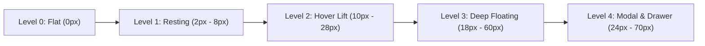

# Grapplin Design System (v2.0)

> **"Snag any link. Recall with a whisper."**  
> A private, search-first design system engineered for high-density knowledge retrieval, tactile micro-interactions, and refined editorial elegance.

---

## 1. Design Philosophy & Ethos

Grapplin’s visual language departs from generic SaaS clichés (dark purple neon dashboards, flat monochromatic templates, icon-stuffed bento boxes) in favor of an **editorial, research-grade aesthetic** inspired by premium archival publications, physical stationery, and modern vector computational interfaces.

```
┌────────────────────────────────────────────────────────────────────────┐
│                        DESIGN PILLARS                                  │
├───────────────────┬─────────────────────────┬──────────────────────────┤
│ 1. Editorial Warmth│ 2. High-Velocity Search │ 3. Tactile Motion Physics│
│    Warm parchment │    Instant 30ms recall, │    Hardware-accelerated  │
│    paper & deep   │    floating search bar, │    3D tilt, spring curves│
│    midnight ink   │    capsules & sparks    │    & spatial depth       │
└───────────────────┴─────────────────────────┴──────────────────────────┘
```

### Core Principles

1. **Utility First**: Ingest → Index → Retrieve. Every interface element exists to accelerate saving or finding knowledge.
2. **Harmonious Contrast**: High-legibility typography (warm paper backgrounds `#fbfaf5` paired with deep midnight ink text `#0b1028`) accented by high-voltage electric lime (`#c8ff1a`) for focus and active triggers.
3. **Physics-Driven Feedback**: Micro-animations are responsive and organic, using custom cubic bezier curves and GSAP spring tweens instead of robotic linear transitions.
4. **Zero Decorative Clutter**: No arbitrary gradients across headline texts, no artificial dark-theme purple glows, no nested card mazes.

---

## 2. Color Palette & Token Architecture

Grapplin uses a custom semantic HSL/Hex token hierarchy defined on the `:root` level and scoped across components.

```mermaid
graph TD
    Root[":root CSS Variables"] --> Foundation[Foundation Surfaces]
    Root --> Brand[Brand Accents]
    Root --> Semantic[Platform & Category Badges]
    Root --> Feedback[Status & Feedback]

    Foundation --> Paper["--paper: #fbfaf5 (Warm Canvas)"]
    Foundation --> Surface["--surface: #ffffff (Card Surface)"]
    Foundation --> Ink["--ink: #0b1028 (Primary Midnight Ink)"]
    Foundation --> Line["--line: #deded8 (Borders & Dividers)"]
    Foundation --> Muted["--muted: #667085 (Meta & Secondary)"]

    Brand --> Accent["--accent: #c8ff1a (Electric Lime)"]
    Brand --> AccentSoft["--accent-soft: #efffc1 (Soft Lime Tint)"]
    Brand --> Lavender["--lavender: #f1efff (Lavender Tint)"]

    Semantic --> GitHub["GitHub: #181717 / #0b1028"]
    Semantic --> YouTube["YouTube: #ffe4df / #f03a22"]
    Semantic --> Instagram["Instagram: #f5e7ff / #b032b0"]
    Semantic --> Reddit["Reddit: #ffebdf / #f4511e"]
    Semantic --> Web["Web/Articles: #e9f2e4 / #4d7c0f"]

    Feedback --> Success["Ready/Indexed: #ecfccb / #3f6212"]
    Feedback --> Danger["--danger: #c22929 / #fff2f2"]
```



### 2.1 Foundation Colors

| Token Name  | Hex Code  | RGB                  | HSL                  | Role / Usage Context                               | WCAG Contrast vs Canvas |
| :---------- | :-------- | :------------------- | :------------------- | :------------------------------------------------- | :---------------------- |
| `--paper`   | `#fbfaf5` | `rgb(251, 250, 245)` | `hsl(48, 43%, 97%)`  | Primary page canvas & application background       | Base (1.00:1)           |
| `--surface` | `#ffffff` | `rgb(255, 255, 255)` | `hsl(0, 0%, 100%)`   | Card surface, search input container, modals       | 1.04:1                  |
| `--ink`     | `#0b1028` | `rgb(11, 16, 40)`    | `hsl(231, 57%, 10%)` | Primary typography, dark buttons, active pills     | 16.82:1 (AAA)           |
| `--muted`   | `#667085` | `rgb(102, 112, 133)` | `hsl(220, 13%, 46%)` | Secondary copy, timestamps, domain meta, borders   | 4.88:1 (AA)             |
| `--line`    | `#deded8` | `rgb(222, 222, 216)` | `hsl(60, 7%, 86%)`   | Structural border lines, dividers, subtle outlines | 1.35:1                  |

### 2.2 Brand & Accent Tokens

| Token Name      | Hex Code  | RGB                  | HSL                   | Role / Usage Context                                                | Contrast vs Ink / White |
| :-------------- | :-------- | :------------------- | :-------------------- | :------------------------------------------------------------------ | :---------------------- |
| `--accent`      | `#c8ff1a` | `rgb(200, 255, 26)`  | `hsl(74, 100%, 55%)`  | Electric lime focus ring, highlight marker, selection, star accents | 14.12:1 vs Ink (AAA)    |
| `--accent-soft` | `#efffc1` | `rgb(239, 255, 193)` | `hsl(76, 100%, 88%)`  | Badge background, chip hover background, strategy tags              | 15.35:1 vs Ink          |
| `--lavender`    | `#f1efff` | `rgb(241, 239, 255)` | `hsl(247, 100%, 97%)` | Subtle editorial tint, notice washes                                | 15.61:1 vs Ink          |
| `--danger`      | `#c22929` | `rgb(194, 41, 41)`   | `hsl(0, 65%, 46%)`    | Destructive buttons, error notices, deletion confirms               | 4.95:1 vs Paper         |

### 2.3 Source & Platform Identity Palette

Grapplin categorizes ingested knowledge by platform with dedicated background tiles and foreground icon colors:

| Source Type           | Tile Background     | Icon Foreground | Pill Border / Fill    | Usage Example                          |
| :-------------------- | :------------------ | :-------------- | :-------------------- | :------------------------------------- |
| **GitHub**            | `#0b1028` (`--ink`) | `#ffffff`       | `#f4f3ed` / `#181717` | GitHub starred repos & code snippets   |
| **YouTube**           | `#ffe4df`           | `#f03a22`       | `#ffe4e6` / `#e11d48` | Video bookmarks, tutorials, timestamps |
| **Reddit**            | `#ffebdf`           | `#f4511e`       | `#ffedd5` / `#9a3412` | Discussion threads & community answers |
| **Instagram**         | `#f5e7ff`           | `#b032b0`       | `#fae8ff` / `#86198f` | Visual references & social saves       |
| **X (Twitter)**       | `#0b1028`           | `#ffffff`       | `#f4f3ed` / `#0b1028` | Threads & tech announcements           |
| **Website / Article** | `#e9f2e4`           | `#4d7c0f`       | `#ecfccb` / `#3f6212` | Blogs, documentation, research papers  |

### 2.4 Status & Feedback Palette

| State                 | Background | Text / Icon Color | Border    | Pulse / Indicator Dot    |
| :-------------------- | :--------- | :---------------- | :-------- | :----------------------- |
| **Ready / Synced**    | `#ecfccb`  | `#3f6212`         | `#d9f99d` | `#65a30d` (`.pulse-dot`) |
| **Indexed (Neutral)** | `#f3f4f6`  | `#4b5563`         | `#e5e7eb` | `#9ca3af`                |
| **Error / Alert**     | `#fff2f2`  | `#8f2020`         | `#f1c6c6` | `#c22929`                |
| **Info / Progress**   | `#f7f6ff`  | `#31355a`         | `#dcd8fb` | `#6366f1`                |

### 2.5 Semantic Query Highlighting & Concept Chips

When parsing natural language and memory queries, Grapplin uses soft pastel highlighters to distinguish query components:

- **Action / Command Highlight (`.hl-pink`)**: Background `#ffe4e6`, Text `#9f1239` (e.g., _`"fast rust cli tool"`_)
- **Intent / Target Highlight (`.hl-orange`)**: Background `#ffedd5`, Text `#9a3412` (e.g., _`"downloading & converting 4k video"`_)
- **Concept Chips (`.f-tag`)**:
  - Rust / Tech: `#fdf2f8` bg, `#be185d` text, `#fbcfe8` border
  - Media / Video: `#fff7ed` bg, `#c2410c` text, `#ffedd5` border
  - Audio / NLP: `#f0fdf4` bg, `#15803d` text, `#bbf7d0` border
  - Performance: `#eff6ff` bg, `#1d4ed8` text, `#bfdbfe` border

---

## 3. Typography & Text Hierarchy

Grapplin pairs a **classical editorial serif** with an **ultra-crisp geometric sans-serif** to create visual prestige and extreme legibility.

```
┌────────────────────────────────────────────────────────────────────────┐
│                        FONT PAIRING SYSTEM                             │
├───────────────────────────────────┬────────────────────────────────────┤
│ --serif                           │ --sans                             │
│ Georgia, "Times New Roman", serif │ Inter, ui-sans-serif, system-ui,   │
│                                   │ -apple-system, BlinkMacSystemFont  │
│ Usage: Headlines, Brand, Hero,    │ Usage: UI Controls, Inputs, Meta,  │
│ Section Titles, Modal Headers     │ Result Excerpts, Badges, Tables    │
└───────────────────────────────────┴────────────────────────────────────┘
```

### 3.1 Type Scale Specification

| Hierarchy Level          | Font Family    | Size (Desktop / Mobile)    | Line Height   | Letter Spacing       | Weight          |
| :----------------------- | :------------- | :------------------------- | :------------ | :------------------- | :-------------- |
| **Display Hero (H1)**    | `--serif`      | `clamp(40px, 5.2vw, 68px)` | `1.02`        | `-0.04em`            | 700 (Bold)      |
| **Section Heading (H2)** | `--serif`      | `clamp(30px, 3.5vw, 42px)` | `1.12`        | `-0.03em`            | 700 (Bold)      |
| **Modal / Sheet Title**  | `--serif`      | `28px - 30px`              | `1.15`        | `-0.03em`            | 700 (Bold)      |
| **Card Title (H3)**      | `--sans`       | `18px`                     | `1.30`        | `-0.01em`            | 700 (Bold)      |
| **Search Main Input**    | `--sans`       | `17px`                     | `1.40`        | `normal`             | 500 (Medium)    |
| **Body / Excerpt Text**  | `--sans`       | `14px - 15px`              | `1.50 - 1.55` | `normal`             | 400 - 500       |
| **Capsule / Pill Label** | `--sans`       | `13.5px`                   | `1.20`        | `normal`             | 650 (Semi-bold) |
| **Metadata & Subtext**   | `--sans`       | `12px - 12.5px`            | `1.40`        | `0.01em`             | 500 - 600       |
| **Micro Labels & Tags**  | `--sans`       | `11px - 11.5px`            | `1.00`        | `0.04em (Uppercase)` | 700 (Bold)      |
| **Code / Vector Vector** | `ui-monospace` | `12px`                     | `1.45`        | `normal`             | 500 (Medium)    |

---

## 4. Spacing, Elevation & Shape System

### 4.1 Spacing Scale

Grapplin utilizes an 8-point harmonic spacing grid:

- `4px` (`0.25rem`) — Micro icon gaps, tag padding
- `8px` (`0.50rem`) — Chip margins, internal badge gaps
- `12px` (`0.75rem`) — Capsule scroll gaps, search box element spacing
- `16px` (`1.00rem`) — Card vertical gaps, form padding
- `24px` (`1.50rem`) — Card padding, modal internal gutter
- `32px` (`2.00rem`) — Section margins, page header spacing
- `48px - 80px` — Major section padding on landing canvas

### 4.2 Elevation, Depth & Box Shadows



| Elevation Level                    | Shadow CSS Rule                       | Applied Component                      |
| :--------------------------------- | :------------------------------------ | :------------------------------------- |
| **Resting Card (Level 1)**         | `0 2px 8px rgba(0, 0, 0, 0.03)`       | `.result-card`, `.memory-capsule-item` |
| **Floating Search (Level 2)**      | `0 8px 30px rgba(11, 16, 40, 0.06)`   | `.search-box-v2`                       |
| **Card Hover Lift (Level 2.5)**    | `0 10px 28px rgba(11, 16, 40, 0.07)`  | `.result-card:hover`, `.button:hover`  |
| **Global Deep Float (`--shadow`)** | `0 18px 60px rgba(11, 16, 40, 0.12)`  | `.showcase-mockup-card`, `.login-card` |
| **Quick-View Modal (Level 4)**     | `0 24px 60px rgba(11, 16, 40, 0.20)`  | `.detail-modal-card`                   |
| **Save Sheet Drawer (Level 4)**    | `-18px 0 70px rgba(11, 16, 40, 0.18)` | `.save-sheet`                          |
| **Electric Lime Focus Ring**       | `0 0 0 3px rgba(200, 255, 26, 0.45)`  | `:focus-within`, `.search-box-v2`      |

### 4.3 Border Radii Tokens

- **Pill (`999px`)**: `.memory-capsule-item`, `.source-filters button`, `.result-status-pill`, `.audio-wave-pill`, `.thought-capsule`
- **Extra Large (`28px`)**: `.cinematic-banner-wrapper`
- **Large Card (`18px - 22px`)**: `.result-card`, `.detail-modal-card`, `.search-box-v2`, `.showcase-mockup-card`
- **Medium (`12px - 14px`)**: `.source-tile`, `.search-submit-btn`, `.vague-query-box`
- **Standard Button (`9px`)**: `.button`, `.notice`
- **Small Chip (`6px - 8px`)**: `.tag-chip`, `.spark-chip`, `.search-kbd-hint`, `.card-icon-action-btn`

---

## 5. Animation, Motion & Physics Specifications

Grapplin’s motion design reinforces responsiveness, fluid continuity, and high tactile polish.

```
┌────────────────────────────────────────────────────────────────────────┐
│                        MOTION TIMING CURVES                            │
├───────────────────────┬────────────────────────┬───────────────────────┤
│ Micro-Interactions    │ Smooth Structural Entry│ Physics Springs       │
│ 0.15s - 0.16s ease    │ 0.22s - 0.25s          │ GSAP power2.out /     │
│ (Hover, tap, chip)    │ cubic-bezier           │ power3.out            │
│                       │ (0.16, 1, 0.3, 1)      │ (3D Tilt & Scrolly)   │
└───────────────────────┴────────────────────────┴───────────────────────┘
```

### 5.1 CSS Transitions & Keyframe Catalog

#### 1. Button & Interactive Hover

```css
transition:
  transform 0.16s ease,
  box-shadow 0.16s ease,
  background 0.16s ease;
/* On Hover */
transform: translateY(-1px);
box-shadow: 0 8px 18px rgba(11, 16, 40, 0.09);
```

#### 2. Card Spring Lift

```css
transition: all 0.2s cubic-bezier(0.16, 1, 0.3, 1);
/* On Hover */
transform: translateY(-2px);
border-color: #c4c4bc;
box-shadow: 0 10px 28px rgba(11, 16, 40, 0.07);
```

#### 3. Modal Backdrop (`fadeInModal`)

```css
@keyframes fadeInModal {
  from {
    opacity: 0;
  }
  to {
    opacity: 1;
  }
}
/* Applied to: .detail-modal-backdrop (0.2s ease-out) */
```

#### 4. Modal Entry Scale & Slide (`slideUpModal`)

```css
@keyframes slideUpModal {
  from {
    transform: translateY(20px) scale(0.98);
    opacity: 0;
  }
  to {
    transform: translateY(0) scale(1);
    opacity: 1;
  }
}
/* Applied to: .detail-modal-card (0.25s cubic-bezier(0.16, 1, 0.3, 1)) */
```

#### 5. Drawer Edge Slide (`slide-in`)

```css
@keyframes slide-in {
  from {
    transform: translateX(28px);
    opacity: 0.65;
  }
  to {
    transform: translateX(0);
    opacity: 1;
  }
}
/* Applied to: .save-sheet (0.22s ease-out) */
```

#### 6. Audio / Vector Spectrum Bars (`wavePulse`)

```css
@keyframes wavePulse {
  from {
    transform: scaleY(0.4);
  }
  to {
    transform: scaleY(1.3);
  }
}
/* Staggered across 6 bars (1s ease-in-out infinite alternate, delays 0.1s - 0.5s) */
```

#### 7. Staggered Dot Pulse (`dotPulse`)

```css
@keyframes dotPulse {
  0%,
  80%,
  100% {
    opacity: 0.2;
    transform: scale(0.8);
  }
  40% {
    opacity: 1;
    transform: scale(1.3);
  }
}
/* Applied to .dot-pulse across 5 dots (.d-1 to .d-5) with 0.2s progressive delays */
```

---

### 5.2 Interactive Physics & Spatial Canvas Systems

#### A. 3D Tilt Physics Hook (`use3DTilt`)

Interactive cards (such as the landing hero mockup and demo boxes) calculate mouse coordinates relative to the element center and apply real-time Euler rotation with GSAP dampening:

- **Perspective**: `1400px`
- **Max Tilt Angle**: `±7°`
- **Scale on Cursor Hover**: `1.012`
- **Damping Speed**: `0.35s` (`ease: "power2.out"`)
- **Reset on Leave**: `0.45s` smooth return to `rotateX: 0, rotateY: 0, scale: 1`

```typescript
const rotateX = ((y - centerY) / centerY) * -maxTilt;
const rotateY = ((x - centerX) / centerX) * maxTilt;
gsap.to(el, { rotateX, rotateY, scale, duration: speed, ease: "power2.out" });
```

#### B. 768-Dimension Semantic Constellation (3D Canvas)

Renders a live 3D spherical hyperspace cluster representing Gemini embedding space:

- **FOV Perspective**: `300`
- **Rotation Physics**: Continuous base rotation (`rotY += 0.004`) modulated by mouse dampening vector.
- **Euclidean Connection Distance**: Dynamically links nodes within 130 3D Euclidean units with alpha transparency:
  $$\alpha = (1 - \frac{d}{130}) \times 0.35 \times \min(scale_1, scale_2)$$
- **Depth Sorting**: Sorts projected z-coordinates prior to draw execution to maintain true volumetric rendering order.

#### C. Pinned Scrollytelling (`ScrollTrigger`)

The `ScrollShowcase` scrollytelling section creates an 1800px scrubbed pin sequence:

- Smoothly advances from **Stage 1 (Vague Natural Thought)** → **Stage 2 (Dual Engine RRF Fusion)** → **Stage 3 (Instant High-Context Recall)**.
- Stepper indicator bar translates along the Y axis with `gsap.to(indicator, { y: activeStep * 68, duration: 0.35 })`.

#### D. Ambient Atmospheric Flow (Cinematic Thought Banner)

- **Parallax Background**: Subtle background zoom and translation (`scale: 1.05 → 1.15, y: -20 → 20`) scrubbed against viewport scroll.
- **Dotted Vector Loop**: Continuous SVG trajectory with `strokeDashoffset: -400` animating over a 20s infinite loop.
- **Floating Sine Waves**: Floating memory capsules perturb along a sine wave (`duration: 3.5s + i * 0.4s`, `ease: "sine.inOut"`, `yoyo: true`).

---

## 6. Core Component Catalog

### 6.1 Buttons

```html
<!-- Primary Button -->
<button class="button button-ink">
  <svg>...</svg>
  <span>Search Library</span>
</button>

<!-- Accent Action Button -->
<button class="button button-accent">
  <span>Save Link</span>
</button>

<!-- Secondary Neutral Button -->
<button class="button button-secondary">
  <span>Cancel</span>
</button>
```

| Variant           | Class Name                        | Background | Text Color | Border    | Hover State                          |
| :---------------- | :-------------------------------- | :--------- | :--------- | :-------- | :----------------------------------- |
| **Primary / Ink** | `.button-ink` / `.button-primary` | `#0b1028`  | `#ffffff`  | `#0b1028` | `translateY(-1px)` + elevation       |
| **Accent Lime**   | `.button-accent`                  | `#c8ff1a`  | `#0b1028`  | `#a6d800` | `translateY(-1px)` + brightened tint |
| **Secondary**     | `.button-secondary`               | `#ffffff`  | `#0b1028`  | `#deded8` | `translateY(-1px)` + subtle shadow   |
| **Icon Action**   | `.card-icon-action-btn`           | `#ffffff`  | `#667085`  | `#deded8` | `#fbfaf5` bg, `#0b1028` icon         |
| **Direct Open**   | `.open-button`                    | `#ffffff`  | `#0b1028`  | `#deded8` | `#c8ff1a` bg (Lime takeover)         |

---

### 6.2 Floating Search Bar V2

The search bar is the centerpiece of the application experience.

```html
<section class="search-input-section">
  <form class="search-box-v2">
    <search class="search-icon-left" size="22" />
    <input
      type="search"
      class="search-main-input"
      placeholder="Search anything you've saved — keywords, vague thoughts, topics…"
    />
    <button type="button" class="search-clear-btn" aria-label="Clear query">
      <X size="14" />
    </button>
    <kbd class="search-kbd-hint">⌘K</kbd>
    <button type="submit" class="button button-ink search-submit-btn">
      <Sparkles size="16" />
      <span>Search</span>
    </button>
  </form>
</section>
```

**Key Features**:

- **Min Height**: `68px`
- **Border**: `1px solid #c9cac5` with `18px` border radius.
- **Focus Ring**: `border-color: var(--ink)` + `box-shadow: 0 0 0 3px rgba(200, 255, 26, 0.45)`.
- **Integrated Elements**: Left icon, auto-expanding text input, instant clear circle, keyboard indicator badge (`⌘K`), and high-contrast submit button.

---

### 6.3 Memory Discovery Capsules & Vague Sparks

#### Horizontal Memory Discovery Capsules (`.memory-capsules-scroll`)

Used for quick, single-tap access to query memories, starred GitHub repositories, or categorized media.

- Pill shape (`padding: 7px 16px 7px 9px`, `border-radius: 999px`).
- Circular icon bubble (`28px × 28px`) with category color wash (lime, purple, blue, red).
- Active state transforms capsule into deep midnight ink with elevated shadow.

#### Vague Memory Sparks (`.search-sparks-row`)

Suggestions presented below the search box representing human-style queries:

- Chip styling: `#f4f3ed` background, `#e4e3dc` border, `8px` radius.
- Hover transition: Turns into soft lime `#efffc1` with `#c8ff1a` border.

---

### 6.4 Result Card V2 (Rich Card Design)

```html
<article class="result-card result-card-interactive">
  <!-- Column 1: Source Tile -->
  <div class="source-github">
    <div class="source-tile">
      <GithubIcon size="24" />
    </div>
  </div>

  <!-- Column 2: Core Content Body -->
  <div class="result-body">
    <div class="result-top-badges">
      <span class="result-source-badge">
        <span class="source-dot"></span> GitHub
      </span>
      <span class="result-domain-tag">github.com</span>
      <span class="result-status-pill ready-pill">
        <span class="pulse-dot"></span> Ready
      </span>
    </div>

    <h3 class="result-title">
      <a href="...">astral-sh / uv</a>
    </h3>

    <p class="result-excerpt">
      An extremely fast Python package and project manager written in Rust...
    </p>

    <div class="result-notes">
      <span class="notes-quote-mark">“</span>
      Replaces pip, virtualenv, and poetry with 100x speedups.
    </div>

    <div class="tag-list">
      <span class="tag-chip">#rust</span>
      <span class="tag-chip">#python</span>
    </div>
  </div>

  <!-- Column 3: Meta & Quick Action Rail -->
  <div class="result-meta">
    <div class="result-meta-info">
      <span class="meta-domain-link">github.com ↗</span>
      <span class="meta-date">Saved Aug 15</span>
    </div>
    <div class="result-action-bar">
      <button class="card-quick-view-btn">Quick View</button>
      <a href="..." class="open-button" title="Open source">↗</a>
    </div>
  </div>
</article>
```

**Grid Architecture**:

- Desktop: `grid-template-columns: 60px minmax(0, 1fr) 230px`
- Responsive Tablet (<900px): `grid-template-columns: 52px minmax(0, 1fr)` (Meta stacks cleanly below).

---

### 6.5 Item Detail Quick-View Modal

- **Backdrop**: `position: fixed`, `background: rgba(11, 16, 40, 0.45)`, `backdrop-filter: blur(8px)`, animated via `fadeInModal`.
- **Card**: `width: min(720px, 100%)`, `max-height: 88vh`, `border-radius: 22px`, `border: 1px solid rgba(222, 222, 216, 0.8)`, `box-shadow: 0 24px 60px rgba(11, 16, 40, 0.20)`.
- **Animation**: `slideUpModal 0.25s cubic-bezier(0.16, 1, 0.3, 1)`.

---

### 6.6 Save Sheet (Slide-over Drawer)

- **Backdrop**: Fixed overlay with `rgba(11, 16, 40, 0.26)`.
- **Drawer**: `width: min(520px, 100%)`, `height: 100%`, `background: var(--paper)`, `box-shadow: -18px 0 70px rgba(11, 16, 40, 0.18)`.
- **Header**: Warm white `#fff` sticky bar with `30px` serif title and close trigger.
- **Animation**: `slide-in 0.22s ease-out`.

---

## 7. Glassmorphism, Texture & Surface Standards

Grapplin incorporates modern CSS backdrop filters to maintain contextual spatial awareness without compromising readability:

1. **Sticky Top Navigation (`.landing-nav-wrapper`, `.topbar`)**:

   ```css
   background: rgba(251, 250, 245, 0.88);
   backdrop-filter: blur(14px);
   -webkit-backdrop-filter: blur(14px);
   border-bottom: 1px solid rgba(222, 222, 216, 0.7);
   ```

2. **Thought Bubbles & Floating Badges (`.capsule-bubble`, `.cinematic-badge`)**:

   ```css
   background: rgba(15, 23, 42, 0.75);
   backdrop-filter: blur(14px);
   -webkit-backdrop-filter: blur(14px);
   border: 1px solid rgba(255, 255, 255, 0.2);
   ```

3. **Selection Highlighting**:
   ```css
   ::selection {
     background: var(--accent);
     color: var(--ink);
   }
   ```

---

## 8. Responsive Breakpoints & Mobile Adaptations

Grapplin follows a desktop-first responsive degradation philosophy with specific mobile breakpoints:

```
┌────────────────────────────────────────────────────────────────────────┐
│                        RESPONSIVE BREAKPOINTS                          │
├──────────────────────────┬────────────────────────┬────────────────────┤
│ Desktop / Wide Screens   │ Tablet / Medium        │ Mobile Handheld    │
│ ≥ 1024px                 │ 641px - 900px          │ ≤ 640px            │
│ 3-Col Cards, Fixed Nav,  │ 2-Col Cards, Scaled 3D │ 1-Col Stack,       │
│ Full Scrollytelling Pinned│ Canvas, Collapsed Meta │ Fixed Bottom Nav,  │
│                          │                        │ Mobile Save FAB    │
└──────────────────────────┴────────────────────────┴────────────────────┘
```

### Mobile Layout Patterns (≤ 640px)

- **Top Bar**: Preserves brand logo and profile menu, hides desktop text navigation links.
- **Fixed Bottom Nav (`.mobile-nav`)**: Sticky dock at bottom of viewport (`height: 62px`, `background: rgba(251, 250, 245, 0.95)`, `backdrop-filter: blur(12px)`).
- **Floating Mobile Save FAB (`.mobile-save`)**: Fixed circular action button (`width: 56px, height: 56px, background: var(--accent), border-radius: 50%`) with elevated shadow.
- **Result Cards**: Collapse from 3 columns into a single vertical column with wrap-around metadata tags and full-width touch targets.

---

## 9. Accessibility (a11y) & Usability Standards

1. **Color Contrast**: All primary text (`#0b1028` on `#fbfaf5`) achieves an extraordinary **16.8:1 contrast ratio**, exceeding WCAG AAA standards.
2. **Keyboard Navigation**:
   - Focus states feature high-visibility electric lime glow rings (`0 0 0 3px rgba(200, 255, 26, 0.45)`).
   - Global shortcut `⌘K` / `Ctrl+K` brings focus to the primary search input.
3. **Screen Readers**:
   - `.visually-hidden` class hides decorative icons or assistive labels while preserving screen reader announcement.
   - Modals trap focus and specify `role="dialog"` with `aria-modal="true"`.
4. **Reduced Motion**:
   - Complex 3D canvas and GSAP scroll triggers honor `prefers-reduced-motion: reduce` by disabling continuous frame rendering.

---

## 10. Design System Quick Reference Cheat Sheet

```css
/* Quick CSS Variables Copy-Paste */
:root {
  /* Canvas & Base */
  --paper: #fbfaf5;
  --surface: #ffffff;
  --ink: #0b1028;
  --muted: #667085;
  --line: #deded8;

  /* Brand Accents */
  --accent: #c8ff1a;
  --accent-soft: #efffc1;
  --lavender: #f1efff;
  --danger: #c22929;

  /* Elevation */
  --shadow: 0 18px 60px rgba(11, 16, 40, 0.12);

  /* Typography */
  --serif: Georgia, "Times New Roman", serif;
  --sans:
    Inter, ui-sans-serif, system-ui, -apple-system, BlinkMacSystemFont,
    "Segoe UI", sans-serif;
}
```
